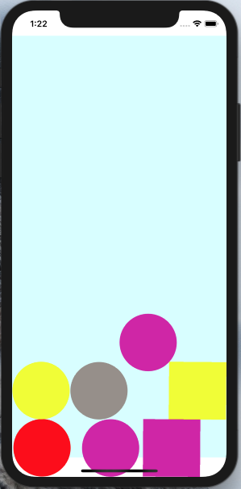
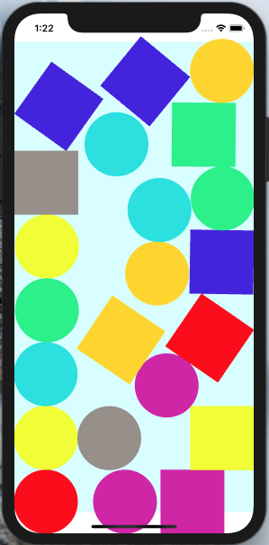

# MotionCube

Have you ever heard “Don’t put your fingers on the screen!”? Of course today this sentence will have no sense. The disappearence of keyboard in favour of touch screens allows application to expend their interface to not be limited by keyboard keys anymore. As a matter of fact, when you used to play snake on a nokia 3310, we just need 4 keys to direct the snake, everything else is useless.

Apple also equiped their devices with different sensors such as an accelerometer, a gyroscope, proximity sensor or a barometer.

Therefore it is possible to retrieve user input or environment data thanks to the screen and the device’s sensors.

This project will teach you how to use the UIGestureRecognizer, to retrieve user’s acctions on the screem as well as CoreMotion to get the orientation of the device in an application that will allow you to play with small squares and small circles. This shapes will be subject to the laws of physics like gravity, elasticity and collision using a UIDynamicAnimator.

# Screanshots

